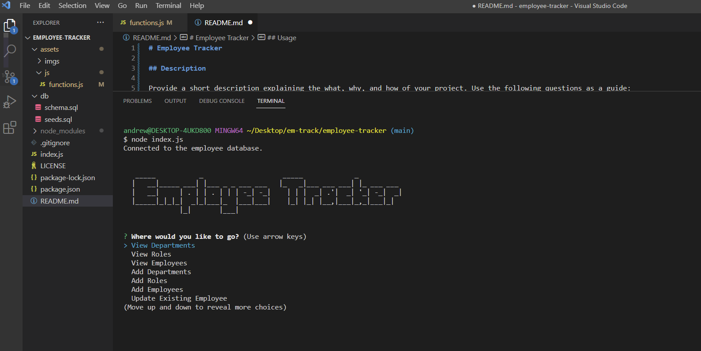

# Employee Tracker

## Description

Employee Tracker is a great way for managers and owners to keep track of employees! You can manage salary, pay! Its easy to update roles and gather information about your employees quickly. My motivstion was to see if I could utilize SQL in a productive and inventive way. I learned about using multiple keys and got to play around with selecting multiple objects at once. If youre struggling to organize your employees or coworkers this could be a great application for you!

## Installation

No install required.

## Usage

Open the terminal and input node index.js

select from the list and view, add or edit!

## Credits

Hannahhue Github: https://github.com/hannahhue/employee-tracker

Watch link:

## License

MIT License

Permission is hereby granted, free of charge, to any person obtaining a copy of this software and associated documentation files (the "Software"), to deal in the Software without restriction, including without limitation the rights to use, copy, modify, merge, publish, distribute, sublicense, and/or sell copies of the Software, and to permit persons to whom the Software is furnished to do so, subject to the following conditions:

The above copyright notice and this permission notice shall be included in all copies or substantial portions of the Software.

THE SOFTWARE IS PROVIDED "AS IS", WITHOUT WARRANTY OF ANY KIND, EXPRESS OR IMPLIED, INCLUDING BUT NOT LIMITED TO THE WARRANTIES OF MERCHANTABILITY, FITNESS FOR A PARTICULAR PURPOSE AND NONINFRINGEMENT. IN NO EVENT SHALL THE AUTHORS OR COPYRIGHT HOLDERS BE LIABLE FOR ANY CLAIM, DAMAGES OR OTHER LIABILITY, WHETHER IN AN ACTION OF CONTRACT, TORT OR OTHERWISE, ARISING FROM, OUT OF OR IN CONNECTION WITH THE SOFTWARE OR THE USE OR OTHER DEALINGS IN THE SOFTWARE.
